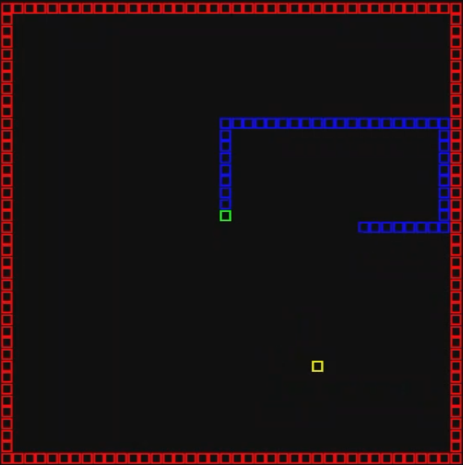

# Snake NEAT

Entrenamiento de una IA para jugar Snake usando **NEAT** (NeuroEvolution of Augmenting Topologies). La red neuronal evoluciona generación a generación sin aprendizaje supervisado — solo selección natural y mutación.



---

## Características

- Evaluación paralela multi-núcleo para acelerar el entrenamiento.
- GUI en tiempo real (Pygame) con simulación del mejor genoma de cada generación.
- Sistema de percepción por **rayos** (raycasting) desde la cabeza de la serpiente.
- Checkpoints automáticos con recuperación ante corrupción (fallback al anterior).
- Visualización de la topología de la red neuronal (requiere Graphviz).
- Parada temprana configurable por estancamiento del fitness.

---

## Instalación

**Requisitos:** Python 3.11+

```powershell
# 1. Crear y activar entorno virtual
python -m venv venv
.\venv\Scripts\Activate.ps1

# 2. Instalar dependencias
pip install -r src/requirements.txt
```

> **Opcional:** Graphviz para visualizar la red neuronal → `winget install graphviz`

---

## Uso

```powershell
# Iniciar (o reanudar) el entrenamiento
python src/snake_ai/train.py

# Reiniciar desde Generación 0 (borra todos los checkpoints)
python reset_evolution.py
```

El programa carga automáticamente el checkpoint más reciente. Si no existe ninguno, inicia desde cero.

---

## Controles de la GUI

| Acción | Descripción |
|---|---|
| Cerrar ventana | Detiene el entrenamiento de forma segura y guarda checkpoint final |
| **Ver Red Neuronal** | Genera y abre el diagrama SVG de la topología del mejor genoma |

---

## Percepción de la red

La serpiente percibe su entorno mediante **4 rayos radiales** lanzados desde su cabeza. Cada rayo reporta:
- Distancia al obstáculo más cercano (pared o cuerpo propio)
- Si hay comida en esa dirección

Entradas adicionales opcionales: distancias a las 4 paredes, dirección normalizada hacia la comida, última dirección, longitud de la serpiente.

---

## Función de fitness

Cada genoma juega **10 partidas** en un tablero de 40×40. El fitness es el promedio:

| Evento | Valor |
|---|---|
| Comer comida | +500.0 |
| Sobrevivir un paso | +0.01 |
| Hambre (sin comer demasiados pasos) | Muerte |
| Victoria (tablero lleno) | +5000.0 y fin |

---

## Parámetros configurables

Todos los hiperparámetros están en `src/snake_ai/parametros.py`:

| Parámetro | Por defecto | Descripción |
|---|---|---|
| `partidas_por_tam` | `10` | Partidas por genoma por generación |
| `habilitar_gui` | `True` | Activa/desactiva la GUI |
| `num_rayos` | `4` | Rayos de visión (cambia `num_inputs`) |
| `incluir_dist_pared` | `True` | +4 entradas: distancias a paredes |
| `incluir_ultima_dir` | `False` | +2 entradas: última dirección |
| `incluir_long_serp` | `False` | +1 entrada: longitud normalizada |
| `long_temporal` | `1` | Frame stacking (1 = sin memoria) |
| `recompensa_comida` | `500.0` | Puntos por comer |
| `max_pasos_hambre` | `tablero² / 4` | Pasos máximos sin comer |
| `intervalo_checkpoint` | `25` | Generaciones entre guardados |

> Si cambias `num_rayos`, `incluir_*` o `long_temporal`, debes actualizar `num_inputs` en `src/snake_ai/config`. El programa lo valida al arrancar e imprime el valor correcto si hay discrepancia.

---

## Arquitectura

```
snake-neat/
├── src/
│   ├── snake_ai/
│   │   ├── train.py          # Punto de entrada: evolución + GUI en hilos paralelos
│   │   ├── parametros.py     # Todos los hiperparámetros configurables
│   │   ├── perception.py     # Vector de observación por raycasting (Numba)
│   │   ├── movement.py       # Selección de dirección sin giros de 180°
│   │   └── config            # Configuración NEAT (población, mutación, etc.)
│   └── neat_reporters/
│       ├── gui.py            # GUI Pygame + reporter en tiempo real
│       └── visualization.py  # Gráficas de fitness, especies y topología de red
├── lib/fast_snake/           # Motor Snake compilado con Numba (@njit)
├── data/                     # Assets: fuentes, sonidos, imágenes
├── docs/                     # Documentación del proyecto
└── reset_evolution.py        # Reinicia el entrenamiento borrando checkpoints
```
